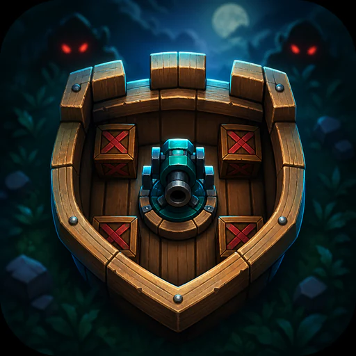
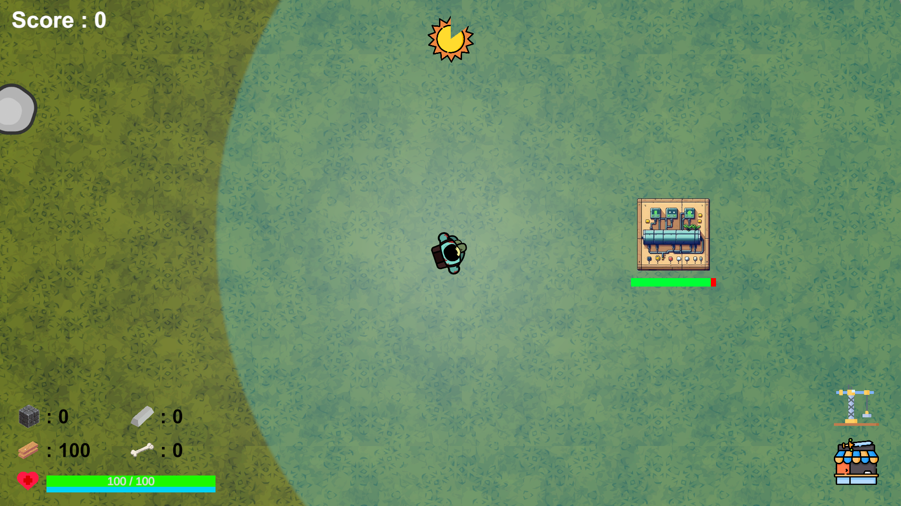
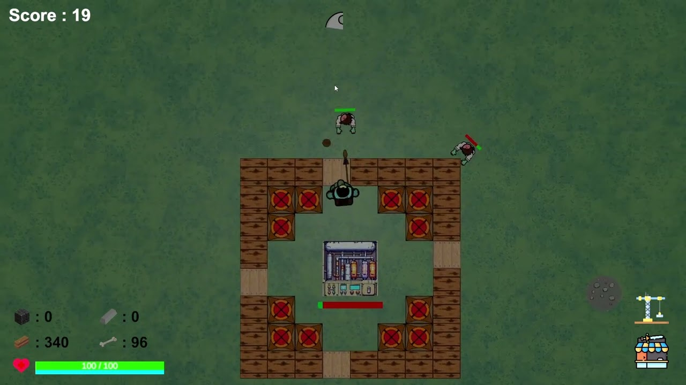

<p align="center">
  
</p>

<h1 align="center">Undying Havoc</h1>

<p align="center">
  Survive the day. Defend the night. Protect your lifeline.
</p>

<p align="center">
  
  
  
  
</p>

## Overview

**Undying Havoc** is a 2D top-down survival and base-defense game built in Unity for PC. Explore the arena and gather resources during the day, then protect the central oxygen generator from increasingly dangerous zombie waves at night.

The game was created over six to eight months as a college project by a team of four student developers led by Dev Patel. This repository contains both the Unity source project and a prebuilt Windows version.

## Preview

<table>
  <tr>
    <td width="50%"></td>
    <td width="50%"></td>
  </tr>
  <tr>
    <td align="center"><sub>Gather resources and prepare during the day.</sub></td>
    <td align="center"><sub>Build and upgrade defenses before the next wave.</sub></td>
  </tr>
</table>

### Gameplay video

[](https://www.youtube.com/watch?v=iRFnBLJYcYs)

<sub>Click the image to watch the gameplay video on YouTube.</sub>

## Highlights

- **Day and night survival loop:** gather and build by day, then defend the generator when night triggers an enemy wave.
- **Resource economy:** collect wood, stone, bone, and iron from resource nodes that spawn across the map.
- **Grid-based construction:** place walls, doors, and turrets, then upgrade or sell structures as the base evolves.
- **Cost-driven enemy waves:** each enemy type consumes part of a growing wave budget, producing varied encounters as the run progresses.
- **Upgradeable equipment:** purchase and improve weapons, buildings, player movement, and generator range through the in-game interfaces.
- **Data-oriented gameplay:** ScriptableObjects hold enemy, resource, weapon, and building data, while reusable pools serve enemies, resources, and projectiles.

## How to play

1. Move through the story screens and enter the main survival scene.
2. Explore during daylight and collect resources from the map.
3. Use the building shop to place defenses around the oxygen generator.
4. Keep the generator supplied, upgrade your weapons and structures, and survive each night wave.
5. Continue for as long as the generator and player remain alive.

## Controls

| Input | Action |
| --- | --- |
| `WASD` or arrow keys | Move the player |
| Mouse | Aim toward the cursor |
| Left click | Attack, gather a nearby resource, interact, or place the selected building |
| Right click | Cancel building placement |
| `1`–`4` | Select a weapon slot |
| Mouse wheel | Cycle through weapons |
| Hold `V` + click a building | Upgrade the building when enough resources are available |
| Hold `X` + click a building | Sell the building |
| Click the oxygen generator | Open or close its resource inventory |
| `Esc` | Pause, resume, or close the current panel |
| `Space` | Advance through story pages |

## Getting started

### Play the included Windows build

The repository includes a Windows player build. Clone or download the complete repository, keep the build files together, and launch:

```text
Undying Havoc(Build)/Undying Havoc.exe
```

### Open the Unity project

Requirements:

- [Unity Hub](https://unity.com/download)
- Unity Editor `2022.3.40f1`
- Git, if cloning from the command line

```bash
git clone https://github.com/Dev0910/Undying-Havoc.git
cd Undying-Havoc
```

1. In Unity Hub, add or open the repository's `Project/` directory.
2. Allow Unity to restore the packages declared in `Project/Packages/manifest.json`.
3. Open `Project/Assets/Scenes/StartScene.unity`.
4. Press **Play** to run from the start screen.

The enabled build sequence continues through the game story, character story, main survival scene, and end scene.

## Technical notes

- **Unity 2D:** the project uses Unity `2022.3.40f1`, the legacy Input Manager, UGUI, TextMesh Pro, Timeline, Post Processing, and DOTween.
- **ScriptableObjects:** enemy statistics, building levels, weapon upgrades, and resource data are stored separately from runtime behavior.
- **Object pooling:** enemies, resources, and projectiles are activated from reusable pools and returned when no longer needed.
- **Wave generation:** the enemy budget grows each round up to a configured cap; enemy types are selected against that budget and spawned around the player.
- **Resource placement:** initial and recurring resource spawns use randomized positions while checking their distance from existing resources and buildings.

## Project structure

```text
Undying-Havoc/
├── Project/
│   ├── Assets/
│   │   ├── Dev_Assets/       # Game events and object pooling
│   │   ├── Scenes/           # Start, story, gameplay, and end scenes
│   │   └── Scripts/          # Gameplay systems grouped by responsibility
│   ├── Packages/             # Unity package manifest and lockfile
│   └── ProjectSettings/      # Unity editor and build configuration
├── Undying Havoc(Build)/     # Included Windows player build
├── docs/media/               # README screenshots and video thumbnail
└── To Do List.pdf            # Original project task document
```

## Development team

| Developer | Role |
| --- | --- |
| Dev Patel | Lead game developer |
| Yash Jadhav | Team member |
| Arpan Chakraborty | Team member |
| Sarthak Nagpure | Team member |

More project context is available on [Dev Patel's portfolio](https://devp2349.wixsite.com/dev-patel-portfoli/undying-havoc).

## Usage and licensing

Undying Havoc was developed as an educational college project and is not licensed for commercial distribution. No formal open-source `LICENSE` file is included in this repository. Included Unity packages and third-party assets remain subject to their respective terms.
